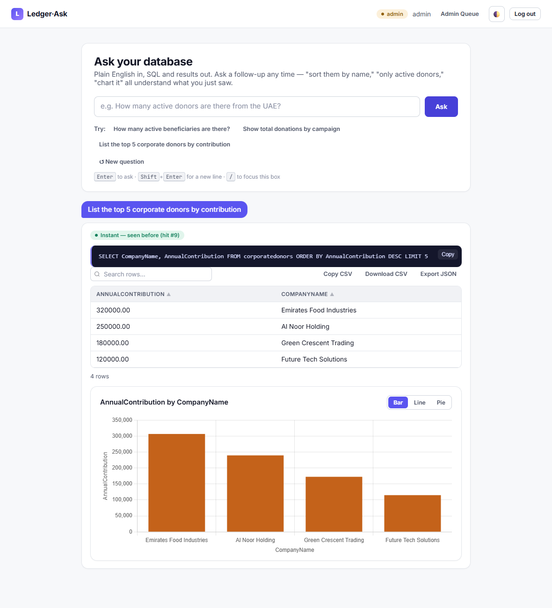
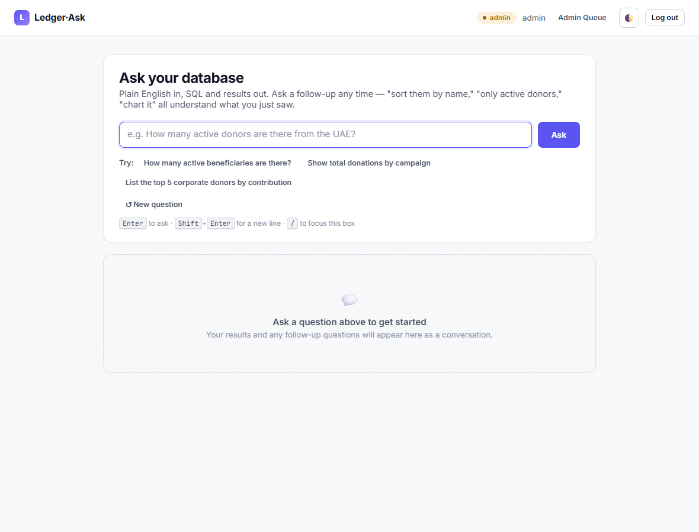
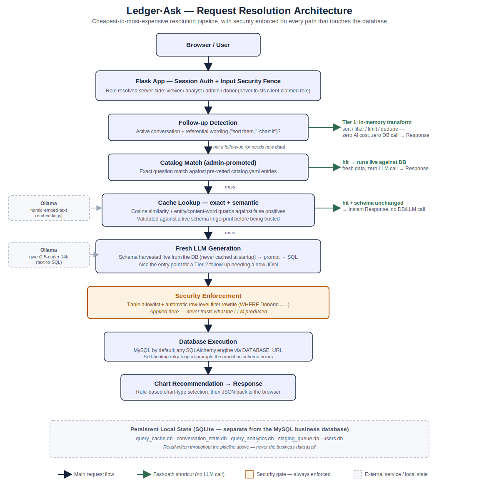

# Ledger·Ask — Enterprise Text-to-SQL Middleware with Analytics


[](https://github.com/BecherDoueidi/ledger-ask/actions/workflows/tests.yml)


A Flask middleware that translates natural-language questions into governed SQL against a MySQL business database, built for a UAE charity's internal reporting use case. The system prioritizes **correctness and safety over raw speed**: every query passes through role-based access control before generation and a table-allowlist + row-level filter rewrite after generation, regardless of what the LLM produces. A three-tier resolution pipeline (deterministic catalog match → in-memory transform → LLM generation) is used to avoid unnecessary model calls wherever a cheaper, deterministic path can answer correctly.

This is a University of Sharjah "Summer 2026 Training" internship project (Compass International LLC, UiPath Automation & AI track).

## Highlights

- **Two-layer, server-side security** — schema-level table allowlisting plus automatic row-level filter rewriting, enforced on every code path regardless of what the LLM generates (never trust the model's output).
- **Four-tier RBAC** — `viewer` / `analyst` / `admin` staff tiers with granular capability flags, plus a row-scoped `donor` self-service role.
- **Semantic query cache** — reuses answers for paraphrased questions via embeddings + cosine similarity, not just exact-string matches, with calibrated guards against false positives.
- **Multi-turn conversation** — follow-up questions ("sort them by name," "chart it") resolve against the existing result set with zero additional AI calls wherever possible.
- **Automatic chart recommendation** — rule-based, extensible chart-type selection from result-set shape, with a manual override switcher in the UI.
- **218 passing tests** (pytest) — unit coverage for every core module plus full end-to-end integration tests, including a test that proves row-level security actually holds through the whole request pipeline.

## Demo

**Ask a plain-English question and get results, SQL, and an auto-recommended chart in one shot:**



The badge above the SQL shows this answer was served from cache instantly (no LLM call) — the same question was asked once before. The chart type (Bar/Line/Pie) can be switched manually without re-asking anything.

**Dashboard, before asking anything:**



## Architecture Diagram



## Quickstart

```bash
git clone https://github.com/<your-username>/ledger-ask.git
cd ledger-ask/project
python -m venv venv
venv\Scripts\activate          # Windows; use `source venv/bin/activate` on macOS/Linux
pip install -r requirements.txt

cp .env.example .env           # fill in your MySQL credentials + a SECRET_KEY
mysql -u root -p < DemoDB_mysql.sql   # creates and seeds the demo MySQL database

# Requires a local Ollama instance with qwen2.5-coder:14b (and nomic-embed-text
# for semantic caching) pulled: https://ollama.com
python app.py                  # serves on http://127.0.0.1:5000
```

Default seeded accounts (change before deploying anywhere real): `admin` / `admin123`, `analyst1` / `analyst123`, `viewer1` / `viewer123`, `donor1` / `donor123`.

Run the test suite with `pytest` from the `project/` directory — it's fully hermetic (no live Ollama or MySQL required).

---

## Executive Summary

Ledger·Ask accepts a natural-language question from an authenticated user, resolves it into MySQL SQL through a cost-ordered pipeline, executes it against the business database under that user's role restrictions, and returns results as a sortable/searchable table plus an auto-recommended chart. Multi-turn conversation is supported: follow-up questions ("sort them by name," "only active donors," "chart it") are resolved against the already-fetched result set without a new AI call when possible. A semantic cache reuses answers for paraphrased questions (not just exact-string repeats). All SQL-generation paths are constrained by the same two-layer security model — schema visibility at prompt-build time, and table-allowlist + row-filter rewrite at execution time — so the LLM's output is never trusted as-is.

---

## Architecture & Tech Stack

- **Backend**: Python 3, Flask (`app.py`) — single-process monolith, no separate API/frontend split.
- **Database (business data)**: MySQL by default, accessed via SQLAlchemy + `pymysql` (`db_config.py`). Connection string built from `.env` (`DB_HOST`, `DB_PORT`, `DB_USER`, `DB_PASSWORD`, `DB_NAME`); `pool_pre_ping=True` to survive MySQL's idle-connection drops. Any other SQLAlchemy-supported dialect (Postgres, SQL Server, SQLite, ...) works by setting `DATABASE_URL` instead — see `db_config.py`'s docstring.
- **LLM inference**: local Ollama instance, model `qwen2.5-coder:14b`, accessed via the OpenAI-compatible client (`openai` package). Embeddings for semantic caching via Ollama's `nomic-embed-text` model.
- **Application-state storage**: SQLite, one file per concern (not the business data) — `query_cache.db`, `conversation_state.db`, `query_analytics.db`, `staging_queue.db`, `users.db`. Kept separate from the MySQL business DB by design.
- **Frontend**: vanilla JS/CSS, no framework. `static/js/app.js` (data table, chart rendering, conversation transcript UI), `static/js/common.js`, `static/css/style.css` (light/dark theme via CSS custom properties + `data-theme` attribute). Charts via Chart.js.
- **Templates**: Flask/Jinja — `templates/login.html`, `templates/index.html` (main dashboard), `templates/admin.html` (staging queue / promotion UI).
- **Testing**: pytest, 218 tests across 15 files in `tests/`. Fixtures in `tests/conftest.py` isolate all SQLite stores to `tmp_path`, fake the LLM, and stand up a temporary SQLite database in place of MySQL for integration tests.
- **Config/secrets**: `.env` (gitignored), `.env.example` as the template. `catalog.yaml` holds deterministic promoted-query manifests.

---

## Current System State (What Works)

**Query resolution pipeline** (cost-ordered, cheapest-first):
1. **Catalog match** (`catalog_manager.py`) — exact/promoted questions in `catalog.yaml` bypass the LLM entirely.
2. **Semantic + exact cache** (`query_cache.py`, `semantic_match.py`, `embeddings.py`) — hybrid cache keyed on exact string match first, then cosine similarity over Ollama embeddings for paraphrases. Guarded against false-positive matches by an entity signature check (numbers/dates/quarters/relative-time terms) and a content-word Jaccard overlap check, calibrated to `SIMILARITY_THRESHOLD=0.80` and `CONTENT_OVERLAP_THRESHOLD=0.5`.
3. **Follow-up resolution** (`followup_resolver.py`) — for multi-turn conversation, a three-tier cost-ordered resolver: Tier 1 applies deterministic in-memory transforms (sort, filter, limit, dedupe, column-select) to the previous result set with zero AI cost; Tier 2 escalates to LLM-assisted SQL modification (reusing the full security/retry pipeline) only when new data (e.g. a new join) is required; anything else falls through to a fresh question.
4. **Fresh LLM generation** — schema is dynamically harvested (`schema_harvester.py`) and injected into the prompt; the model generates SQL against that live schema.

**Security (two-layer, enforced server-side, never trusted to the LLM):**
- **Schema-level**: `roles_config.py` defines per-role `allowed_tables` — the LLM is never shown, and can never reference, tables outside its role's list.
- **Row-level**: roles with a `row_filter_column` (e.g. `donor` → `DonorId`) get every allowed table automatically wrapped in `WHERE <row_filter_column> = <user_id>` before execution, regardless of whether the generated SQL included it.
- **Input guardrail**: command-chaining punctuation (`;`) blocked before model execution.
- **Output fence**: generated SQL is parsed and validated (structural token check) to block DML/DDL statements (`DROP`, `INSERT`, `UPDATE`, `DELETE`, etc.) before execution.
- Four roles are implemented: `viewer`, `analyst`, `admin` (three unrestricted-table staff tiers, differing only in admin-panel capability — see below) and `donor` (self-service, `DonorId`-scoped). Session-based auth via `auth.py`, seeded default users for all four tiers.

**Capability-based admin access** (`roles_config.py`'s `can_*` flags, enforced by `app.py`'s `capability_required` decorator):
- `viewer` — full query access, no admin-panel access at all.
- `analyst` — adds `can_view_admin_panel`: can see the staging queue and analytics, but cannot manage users, clear the shared cache, or promote entries to the catalog.
- `admin` — adds `can_manage_users`, `can_promote_to_catalog`, `can_clear_cache`: full control.
- Every admin-side route names the specific capability it needs (e.g. `@capability_required("can_promote_to_catalog")`) rather than checking `role == "admin"`, so adding a new capability or tier doesn't require touching every route. `templates/admin.html` mirrors this server-side gating in the UI (hides the user-management section and Clear Cache button, and swaps the Promote button for a disabled "Awaiting admin promotion" tag) so lower tiers never see actions they can't take.
- Catalog-promotion eligibility (`roles_config.is_row_restricted`) is judged by whether the *originating* role is row-filtered, not by role name — any of viewer/analyst/admin's questions are equally safe to promote since none of them carry a baked-in row restriction.

**Database portability** — the system is built to keep working correctly if the connected database is swapped, migrated, or restructured, without code changes:
- **Schema is never cached at startup.** `schema_harvester.extract_live_metadata()` re-inspects the live database (via SQLAlchemy's `inspect()`) on every fresh question, so a table/column added, removed, or renamed shows up immediately.
- **Row-scoped roles discover their own table list.** `donor`'s `allowed_tables` isn't a hardcoded list in `roles_config.py` — `roles_config.resolve_allowed_tables()` calls `schema_harvester.discover_row_scoped_tables("DonorId")` fresh on every request, returning every live table that currently has a `DonorId` column. Rename `Donations` to `Contributions` and it's still found and correctly row-filtered; nobody has to update `roles_config.py`.
- **Cache entries carry a schema fingerprint** (`schema_harvester.compute_schema_fingerprint`, a hash of the live table/column shape, stored in `query_cache.db`). A cache lookup compares the stored fingerprint against the database's current shape; on a mismatch (e.g. the whole database was swapped for a different one), the stale entry is invalidated and the request falls through to a fresh LLM+DB round trip instead of silently replaying an answer computed against a schema that no longer exists.
- **Connection string is swappable**: set `DATABASE_URL` in `.env` to point at any SQLAlchemy-supported database engine, not just MySQL (see `db_config.py`). The LLM prompt already reports whatever dialect SQLAlchemy detects.
- What *isn't* automatic: `roles_config.py`'s `row_filter_column` (the ownership-column name to look for, e.g. `"DonorId"`) and `identity_table` (used to validate a donor_id exists when creating an account) are the two pieces of business knowledge that can't be inferred from schema shape alone — if a new database uses a totally different row-ownership convention, those two config values need updating by hand. Everything downstream of them adapts automatically.

**Conversational UX:**
- Session-scoped conversation state (`conversation_state.py`), 30-minute TTL, isolated per user/session.
- Follow-up detection (`is_followup`) distinguishes true follow-ups (pronoun references, leading transform verbs) from unrelated new questions.
- Manual chart-type switcher (Bar/Line/Pie) on rendered charts, independent of the auto-recommendation.

**Data visualization** (`chart_advisor.py`):
- Rule-based chart-type recommendation from result-set column types (numeric/categorical/temporal) and cardinality — no hardcoded per-query logic.
- Extensible `CHART_RULES` registry; supports both fully-automatic recommendation (`forced_type=None`) and explicit user chart requests (`forced_type="auto"` or a specific type), with a generic composite-axis fallback for result shapes the standard rules don't cover.
- Column classification checks temporal-by-name before numeric (avoids misclassifying `GROUP BY YEAR()`/`MONTH()` integer columns), and requires a decimal point for numeric-string detection (avoids treating phone numbers as numeric).

**Frontend:**
- Analytics-dashboard-style UI: scrollable conversation transcript, sortable/searchable/paginated result tables, one-click SQL copy, CSV/JSON export, toast notifications, loading-skeleton states, light/dark theme toggle, responsive layout.
- Admin dashboard (`templates/admin.html`) for reviewing and promoting staged queries into `catalog.yaml`.

**Testing (218 tests, pytest):**
- Unit coverage for every pure-logic module (`chart_advisor`, `semantic_match`, `followup_resolver`, `catalog_manager`, `query_cache`, `conversation_state`, `query_analytics`, `staging_queue`, `access_control`, `auth`, `roles_config`, `schema_harvester`).
- Integration tests (`test_app_integration.py`) drive the full `/api/generate-sql` pipeline via the Flask test client against a fake LLM and a temporary SQLite database standing in for MySQL — including an end-to-end test proving row-level security is actually enforced through the whole stack, not just in isolated unit tests.
- `TestRoleTiers` pins down the viewer/analyst/admin capability boundary: which routes each tier can and can't reach, and that catalog-promotion eligibility follows row-restriction status rather than role name.
- `TestDatabaseSchemaChange` proves the database-portability behavior end-to-end: a cached answer is confirmed to hit normally, the test database's schema is altered mid-test (`ALTER TABLE ... ADD COLUMN`), and the same question is confirmed to NOT replay the stale cached answer — plus a table-rename test confirming a donor's row-scoped table list adapts without any config change.
- All state-bearing modules are redirected to `tmp_path` via autouse fixtures in `conftest.py`; embeddings default to `None` in tests (`no_real_embeddings` fixture) so tests never depend on a live Ollama instance.

---

## Active Work & Immediate Next Steps

- **RBAC tier split is done.** `admin` was split into `viewer` / `analyst` / `admin` (see roles_config.py's `can_*` flags), `donor` unchanged. `app.py` routes, `templates/index.html`, and `templates/admin.html` all gate on capability flags rather than `role == "admin"`. Demo accounts for all four tiers are seeded by `auth.seed_default_users()`.
- **Database portability is done.** The donor role's table access, the schema shown to the LLM, and the query cache all now adapt to a live database's actual current shape instead of assuming a fixed schema — see "Database portability" above. The one remaining manual step after swapping in a genuinely different database is updating `row_filter_column`/`identity_table` in `roles_config.py` if the new schema uses a different row-ownership naming convention.
- **Testing was prioritized as the top gap** and has been substantially closed (218 tests now exist, including `TestRoleTiers` for the RBAC split and `TestDatabaseSchemaChange` for the portability work); next test-worthy surface area is whatever ships next.
- Recently deferred/skipped (per explicit instruction not to duplicate existing coverage): audit trail, query versioning, observability dashboard, query explanations, additional SQL safety hardening beyond the existing DML/DDL fence — these were proposed but not started; re-evaluate priority now that RBAC and testing are both in place.
- Two real bugs were found and fixed via live testing (not caught by the original test suite, now covered by regression tests in `test_followup_resolver.py`):
  - Cache-hit numeric values (MySQL `DECIMAL` round-tripped through JSON as strings) were sorting lexicographically instead of numerically in follow-up sort transforms — fixed in `followup_resolver.py`'s sort branch.
  - A direction word (e.g. "ascending") concatenated onto a field name before column resolution, breaking the field match — fixed by stripping direction words (`_DIRECTION_WORD_PATTERN`) before resolving the column.
  - A results-table search box lost keyboard focus after every character typed — fixed in `static/js/app.js` by capturing and restoring focus/cursor position across the table's `innerHTML` rebuild.

---

## Constraints, Blockers & Known Issues

- **Never trust LLM-generated SQL as-is.** Every generation path — fresh, cached, or follow-up-escalated — must pass through the same table-allowlist + row-filter rewrite and DML/DDL output fence. Any new query-producing code path must be wired through this same enforcement, not bypass it.
- **Business data lives in MySQL; app state lives in SQLite.** Do not conflate the two, and do not add new application state (cache, conversation, analytics, staging) directly into the MySQL business schema — follow the existing pattern of a dedicated SQLite store.
- **Row-level filtering is column-name-driven, not table-name-driven.** A row-filtered role's table list is discovered live from whichever tables currently have the `row_filter_column` (see "Database portability" above) — so this mostly maintains itself. The one thing that still requires a manual `roles_config.py` edit is the row-ownership *column name* itself (`row_filter_column`) and the `identity_table` used for account-creation validation, if a new database uses a different convention for either.
- **`CampaignId`-as-numeric is a known, accepted chart-advisor limitation**: when a query returns `CampaignId` + a numeric aggregate without joining to get a display name, both columns look numeric to the classifier and it renders a scatter chart instead of a bar chart. This is a documented edge case, not a bug to silently "fix" by special-casing `CampaignId` — the correct fix (if pursued) is encouraging joins to display-name columns, not hardcoding column-name exceptions into `chart_advisor.py`.
- **Chart-type switcher excludes scatter** (`SWITCHABLE_TYPES = ["bar", "line", "pie"]`) because scatter requires a different data shape (paired numeric axes) than the categorical-axis chart types — do not add scatter to the switchable set without also handling the data reshape.
- **Semantic cache thresholds are empirically calibrated, not arbitrary** — `SIMILARITY_THRESHOLD=0.80` and `CONTENT_OVERLAP_THRESHOLD=0.5` in `semantic_match.py` were tuned against real embedding-model output (e.g., "this year" vs "last year" scores 0.978 cosine similarity despite being semantically opposite, which is why the entity-signature guard exists independently of the cosine threshold). Do not raise/lower these without re-validating against the documented calibration cases in the module docstring.
- **Tests must stay hermetic.** `conftest.py`'s autouse fixtures redirect all SQLite-backed stores to `tmp_path` and mock embeddings to `None` by default — any new state-bearing module must register itself with the same isolation pattern, and any new test must not depend on a live Ollama instance or the real MySQL database.
- **`import app` runs `auth.seed_default_users()` once per process** — tests that need fresh users per-test must explicitly re-seed; this is a known quirk of the `app_module` fixture, not a bug.
- **CI runs the test suite on every push/PR to `master`** (`.github/workflows/tests.yml`, GitHub Actions). It only runs `pytest` — no deploy step exists yet, so shipping to any real environment is still a manual process.
